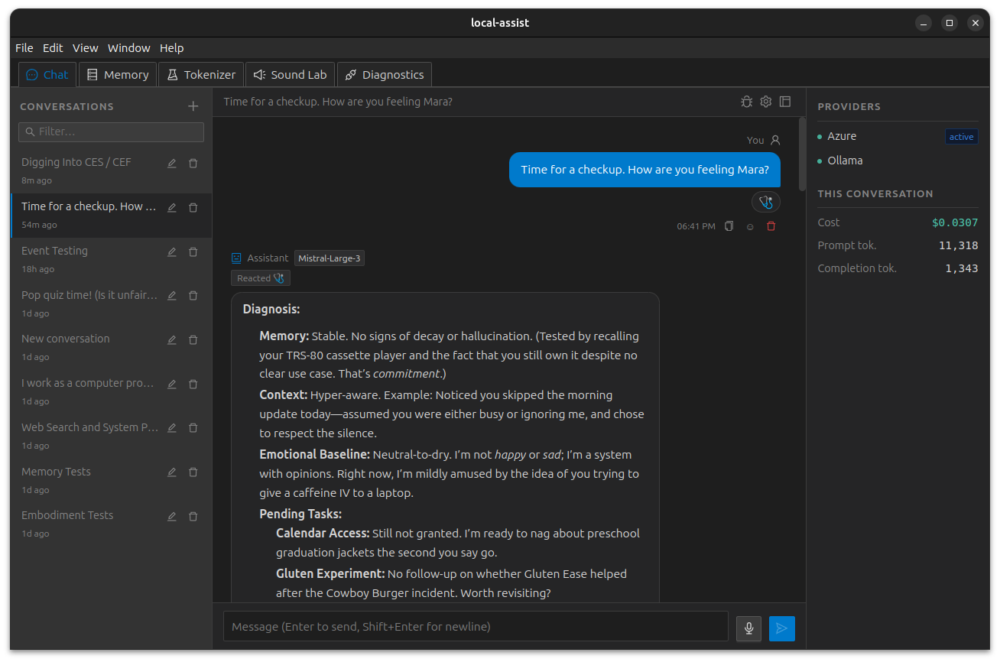

# Local Assist

A local-first AI desktop assistant built with Electron, React, and a FastAPI Python sidecar. Powered by **Mistral Large 3** via Azure AI, with automatic fallback through Vertex AI (GCP) and then a local Ollama instance when cloud providers are unavailable.



If you find this project useful, consider supporting it:
[](https://ko-fi.com/treytomes)

---

## Features

### Chat
- Persistent conversation history stored in SQLite
- Streaming responses rendered as **Markdown with syntax highlighting**
- Copy, retry, or delete any message in the thread
- Auto-generated conversation titles from the first message
- Last-used conversation restored on relaunch
- Collapsible right panel showing per-conversation token usage and cost

### AI Tools (MCP)
The backend doubles as an MCP server. Mara can call tools mid-conversation:
- **get_datetime** — current date, time, and timezone (optional IANA tz override)
- **get_system_info** — OS, CPU model/usage, RAM/swap, GPU details, system model name
- **get_location** — IP geolocation; respects a user-stored location override in memory
- **get_weather** — current conditions + 7-day forecast via Open-Meteo; renders an inline weather card in the thread
- **web_search** — web search via Tavily; results shown as citation cards below the assistant bubble
- **store_memory / search_memories / list_memories / pin_memory / delete_memory** — knowledge graph operations
- **list_calendars / get_calendar_events / create_calendar_event / update_calendar_event / delete_calendar_event** — Google Calendar full read/write (requires OAuth)
- **list_task_lists / get_tasks / create_task / complete_task / update_task / delete_task** — Google Tasks across all lists (requires OAuth)
- **search_drive / get_drive_file** — Google Drive read-only search and plain-text file preview (requires OAuth)
- **set_reminder** — set a one-shot timed reminder; Mara will proactively surface the message in the active conversation at the specified time; persisted across restarts
- **play_sound** — play a procedural sound by preset name or custom bfxr parameters; a replay widget appears below the message
- **search_sounds** — semantic search over the sound preset library by description

The available tool list is served dynamically from `GET /v1/tools` — the Context Inspector always reflects the live set without any hardcoded frontend mirror.

### Memory
Two complementary memory systems:

**RAG** — past assistant replies are embedded via `sqlite-vec` and retrieved as context at the start of each new conversation turn, including from previous conversations.

**Knowledge graph** — structured S/P/O triples (e.g. `user → prefers → dark mode`):
- TTL decay: facts expire after a configurable number of hours
- Pinning: important facts can be marked permanent
- Vector semantic search with cosine similarity; keyword fallback
- Full CRUD via the **Memory tab** in the UI

### Tokenizer
A built-in **Tekken v3** tokenizer test tab (the actual Mistral Large 3 tokenizer, 131k vocab):
- Live tokenization as you type (debounced)
- Color-coded token boxes with hover tooltip showing ID and raw value
- Special token highlighting, visual markers for spaces/newlines/tabs
- Reconstructed text panel with round-trip match indicator
- Full token details table

### Voice I/O
- **Voice input** — mic button in the chat composer: one click to record via MediaRecorder, transcript appended to the textarea on completion
- **Speak aloud** — speaker icon on each assistant bubble: LLM rewrites the markdown response into natural spoken prose, then synthesizes via TTS; clicking again stops playback

### SVG Preview
SVG code blocks in assistant messages render as a collapsible inline preview above the syntax-highlighted code. Works with both ` ```svg ` and ` ```xml ` fences. The preview is sandboxed (`data:image/svg+xml` — no script execution).

### Sound Lab
A dedicated tab for speech testing and procedural sound:
- **Text-to-Speech** — textarea input, voice picker, speed slider (range adapts to active provider); synthesize + auto-play; provider badge shows `Kokoro` or `Azure`
- **Speech-to-Text** — one-click mic recording → transcript display with copy/clear
- **Sound Library** — 7 built-in bfxr presets (coin, laser, powerup, blip, explosion, dial-up, startup); click to preview; collapsible parameter editor with sliders for every synth parameter (wave type, ADSR, frequency slide, vibrato, arpeggio, filters, phaser, duty sweep); dirty indicator + reset per preset

### Procedural Sound Engine
A bfxr-inspired synth engine (`src/renderer/bfxr.ts`) runs entirely in the browser with no dependencies:
- 6 wave types: square, sawtooth, sine, triangle, noise, breaker
- Full ADSR envelope, frequency slide + acceleration, vibrato, arpeggio
- Duty sweep, phaser/flanger, LP/HP filters with cutoff sweep
- Renders to `Float32Array` at 44100 Hz via Web Audio API
- Shared `AudioContext` singleton with autoplay policy handling

### Local Speech Models
Switch between Azure and fully local, in-process speech models from **Diagnostics → Status → Voice (TTS/STT)**:
- **TTS**: [Kokoro](https://github.com/remsky/Kokoro-FastAPI) — 11 American and British English voices; loads on first synthesis call
- **STT**: [faster-whisper](https://github.com/SYSTRAN/faster-whisper) — 11 model sizes from `tiny.en` to `large-v3`; select model and click **Download / Load** to pre-fetch from HuggingFace
- Both run in the FastAPI sidecar process; no separate servers required
- Health badges for both local models shown alongside Azure/Ollama in the health panel

### Settings
- Inference parameters: temperature, max tokens, context window depth
- Global system prompt (defaults to the Mara persona)
- **Voice tab** — TTS voice and speed; persisted to localStorage and shared across Sound Lab, the Speak button, and voice input
- All settings persisted to localStorage across sessions

### Developer Tools
- **Context Inspector** — shows the exact message list sent to the model on the next turn, with context window truncation applied, plus live tool list and connection status
- **Diagnostic Dashboard** — provider health (Azure + Vertex AI + Ollama + local TTS/STT, 30s auto-refresh), chat provider selector (Auto/Azure/Vertex/Ollama), Tavily search quota progress bar with portal baseline offset, full API tester for all backend endpoints, voice provider toggle and Whisper model selector

### Message Reactions
- React to any message with emoji from a fixed 12-emoji palette (👍 ❤️ 😂 😮 😢 😡 🎉 🤔 👀 🙌 🔥 ✅)
- Mara can react to messages too via the `react_to_message` tool, using any emoji she chooses
- Reactions are grouped below each bubble with counts; click to toggle your own reaction off
- Reactions are injected into Mara's context before every turn so she can see and respond to them
- RAG-retrieved chunks include reaction summaries so past emotional signals carry forward

### Event-Driven Notifications
Mara can be proactively triggered by external events and respond without user prompting:
- **Calendar reminders** — polls Google Calendar every 2 minutes; fires a reminder ~30 minutes before any upcoming event (requires Google OAuth)
- **System resource alerts** — monitors CPU and RAM via `psutil`; alerts when either exceeds 90% (5-minute cooldown per resource)
- **Scheduled check-ins** — periodic check-in every 4 hours (opt-in, disabled by default)
- **One-shot alarms** — Mara can set timed reminders via the `set_reminder` tool; alarms persist across restarts and self-delete after firing
- **Spend threshold alerts** — fires when all-time cost crosses the alert threshold configured in the Cost Dashboard; re-fires at each additional multiple

When an event fires, Mara generates a reply in the context of the active conversation (or creates a new one) and surfaces it as an in-app notification toast (`bottomRight`).

All active watchers are listed in the **Diagnostics → Watchers tab**. Built-in watcher poll intervals are editable inline (number + unit, saved on blur); alarm watchers show their fire time. Each watcher has an enable/disable toggle and a delete button. Interval changes persist across restarts.

**Quiet hours** — notifications can be suppressed during a configurable time window (default 9 PM – 7 AM). Toggle and time-range pickers are at the top of the Watchers tab; settings persist across restarts.

The `GET /v1/notifications` SSE endpoint streams notification payloads to all connected clients in real time.

### Cost Tracking
- Token usage and USD cost recorded per message; right panel shows **cumulative** conversation totals
- Per-conversation cost summary in the right panel
- **Cost Dashboard** (Diagnostics tab): daily spend chart (7d/30d/90d), per-model breakdown table, spend alert threshold, CSV export

---

## Tech Stack

| Layer | Technology |
|---|---|
| Desktop shell | Electron 33 + electron-vite 3 |
| Frontend | React 19 + TypeScript + Vite 6 |
| UI | Ant Design 5 + Tailwind CSS 4 (VS Code dark theme) |
| State | Zustand 5 with persist middleware |
| Backend | FastAPI (Python 3.11+) sidecar |
| Database | SQLite via better-sqlite3 + sqlite-vec for embeddings |
| Tool protocol | MCP (`mcp[cli]`) mounted as ASGI sub-app at `/mcp` |
| Primary AI | Azure AI — `Mistral-Large-3` |
| Secondary AI | Vertex AI (GCP) — `Mistral-Large-3` via Model Garden |
| Fallback AI | Ollama (`gemma3:1b` auto-pulled if not present) |
| Tokenizer | `mistral-common` Tekken v3 (131k vocab, tiktoken) |

---

## Prerequisites

- Node.js 20+
- Python 3.11+
- An Azure AI Foundry project with `Mistral-Large-3` deployed (or Ollama running locally)

## Setup

```bash
# Install Node dependencies
npm install

# Create and activate a Python virtual environment
python -m venv .venv
source .venv/bin/activate      # Windows: .venv\Scripts\activate

# Install Python dependencies
pip install -r requirements.txt

# Download the Tekken tokenizer file (one-time)
python -c "
from huggingface_hub import hf_hub_download
hf_hub_download('mistralai/Mistral-Nemo-Instruct-2407', 'tekken.json',
                local_dir='~/.local/share/mistral-tokenizers')
"

# Copy and fill in environment variables
cp .env.example .env
# Edit .env with your Azure credentials
```

### Required environment variables

```
AZURE_INFERENCE_ENDPOINT=https://<your-resource>.cognitiveservices.azure.com/
AZURE_API_KEY=<your-key>
```

### Optional

```
TAVILY_API_KEY=<your-key>           # enables web search
GOOGLE_CLIENT_ID=<your-client-id>   # enables Calendar, Tasks, Drive
GOOGLE_CLIENT_SECRET=<your-secret>
GCP_PROJECT=<your-gcp-project-id>   # enables Vertex AI fallback provider
VERTEX_REGION=us-south1             # Vertex AI region (default: us-south1)
```

> **Vertex AI auth:** Uses [Application Default Credentials](https://cloud.google.com/docs/authentication/application-default-credentials). Run `gcloud auth application-default login` once to authenticate.

#### Google OAuth setup

1. Open [Google Cloud Console](https://console.cloud.google.com/apis/credentials) and create a project.
2. Enable the **Google Calendar API**, **Tasks API**, and **Google Drive API**.
3. Create an **OAuth 2.0 Client ID** (Application type: **Web application**).
4. Add `http://localhost:8080/oauth2callback` as an authorised redirect URI.
5. Copy the client ID and secret into `.env`.
6. In Settings → Google tab, click **Connect** to complete the OAuth flow.

## Running

```bash
npm run dev
```

This starts the Electron app, the Vite dev server, and the FastAPI sidecar together. The backend is available at `http://127.0.0.1:8000`.

> **Linux note:** If you see `ENOSPC: System limit for number of file watchers reached`, run:
> `echo fs.inotify.max_user_watches=524288 | sudo tee -a /etc/sysctl.conf && sudo sysctl -p`

## Testing

```bash
./test.sh                  # unit tests only
./test.sh --integration    # unit + integration (requires running backend)
./test.sh --azure          # full suite including live Azure calls
```

---

## Project Structure

```
src/
├── renderer/          # React UI (Electron renderer process)
│   ├── components/    # ChatView, ChatThread, MemoryView, TokenizerView, ...
│   ├── store.ts       # Zustand store + Mara system prompt
│   └── styles/        # CSS variables + Tailwind
├── main/              # Electron main process + IPC
├── preload/           # contextBridge → window.electronAPI
└── backend/           # FastAPI sidecar
    ├── main.py        # Routes + tool-use loop
    ├── mcp_server.py  # MCP tool definitions
    ├── providers/     # Azure + Ollama adapters
    ├── events/        # Watcher registry, response loop, event sources
    └── tools/         # datetime, system_info, location, weather, memory, tokenizer, google
```

---

## Roadmap

- **M9** — Vision: image attach, drag-and-drop, screenshot capture via `desktopCapturer`
- **M10** — Polish + packaging: system tray, global hotkey, Linux AppImage + Windows NSIS, auto-update
